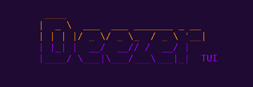
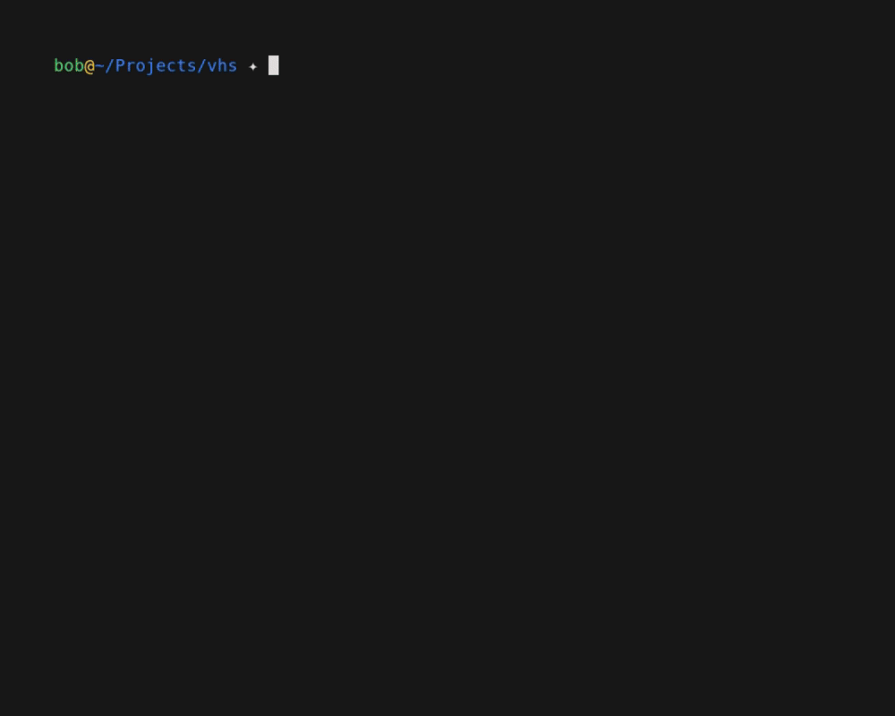

# Deezer TUI

[](https://dl.circleci.com/status-badge/redirect/gh/Tatayoyoh/deezer-tui/tree/main)
[](https://www.rust-lang.org/)
[]()



Bored to use 300M of RAM to play music ?

* for developers <3
* easy account login
* low memory footprint
* music playing in the background
* compliant with deezer features

## Install

Linux / macOS (one-liner)
```bash
curl -LsSf https://raw.githubusercontent.com/Tatayoyoh/deezer-tui/main/install.sh | sh
```

Or copy binary yourself
```bash
wget -qO deezer-tui "https://github.com/Tatayoyoh/deezer-tui/releases/latest/download/deezer-tui-linux-x86_64"
chmod +x deezer-tui
sudo mv deezer-tui /usr/local/bin/deezer-tui
```

## Features

✅ login through deezer.com<br>
✅ background player with [ctrl+z]<br>
✅ search / favorites / radios pages<br>
✅ playing track context menu [ctrl+p]<br>
✅ focused track context menu [m]<br>
✅ Album page ([a] shortcut)<br>
✅ Artist page ([t] shortcut)<br>
✅ Waiting list [w]<br>
✅ shortcut modal [?]<br>
✅ global app menu [ctrl+o] <br>
✅ Themes, from official Deezer themes<br>
✅ Translations <br>
✅ Offline mode with downloaded tracks<br>
✅ Album/Artist miniature (require Kitty or Ghostty for real image display)<br>



## Build on your system

First install
```bash
sudo apt install pkg-config
sudo apt install libasound2-dev
curl https://sh.rustup.rs -sSf | sh
source ~/.bashrc
```

Build
```bash
cargo build --release
```

## Made with our brave Claude Code

And drived by human goods ideas.

To be honest, I am not a Rust developer :p. Rust was a good match for this project 👍.

## Other goods projects

* https://github.com/yne/dzr
* https://github.com/ravachol/kew
* https://tizonia.org/
* https://musikcube.com/
* https://github.com/timdubbins/tap
* https://github.com/tramhao/termusic
* https://www.kariliq.nl/siren/
* https://github.com/raziman18/gomu
* https://github.com/dhulihan/grump
* https://github.com/Kingtous/RustPlayer


